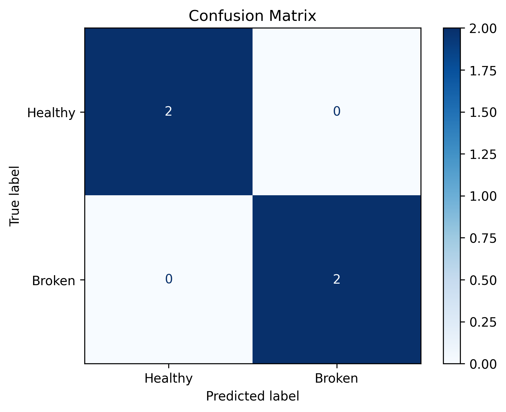
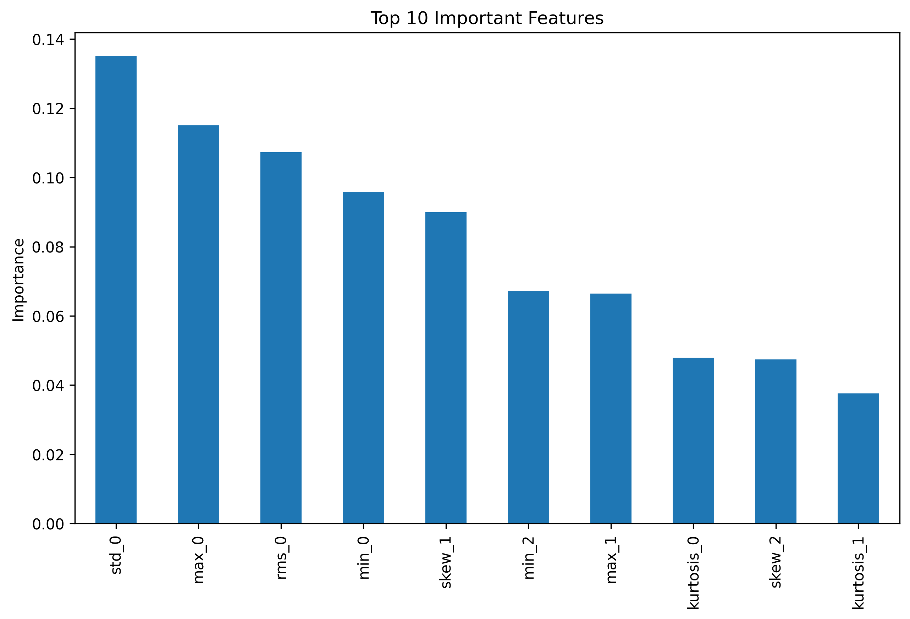
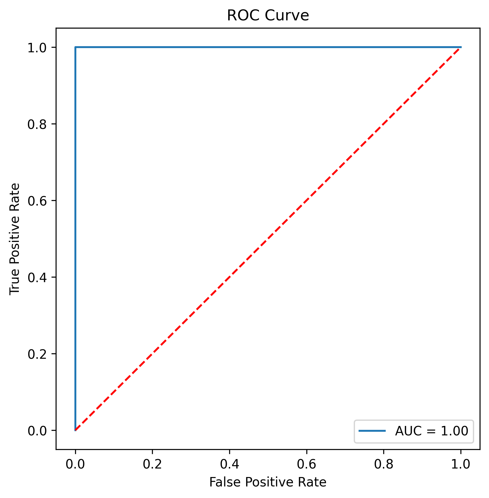
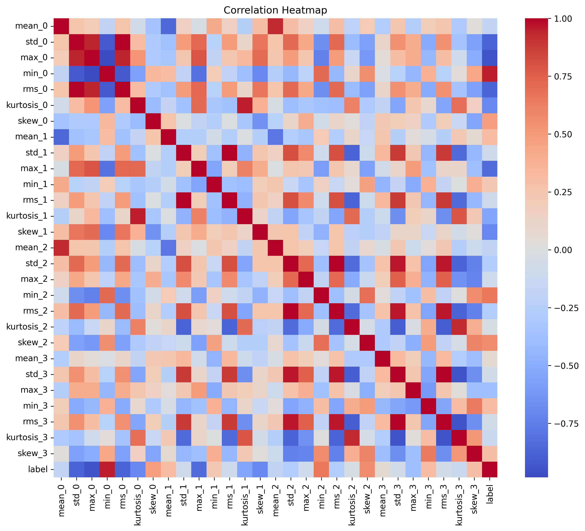

# ⚙️ Predictive Maintenance of Gearbox using Vibration Sensors

## 📌 Project Overview

Predictive Maintenance is an Industry 4.0 approach that helps detect equipment faults before they lead to unexpected machine failures. In this project, vibration sensor data collected from an industrial gearbox is analyzed to classify the gearbox condition as either **Healthy** or **Broken Tooth** using Machine Learning.

The project demonstrates a complete end-to-end predictive maintenance workflow, including statistical feature extraction, exploratory data analysis, machine learning model development, evaluation, visualization, and model serialization.

---

## 🎯 Objectives

- Analyze gearbox vibration sensor signals.
- Extract statistical features from vibration data.
- Build a machine learning model for gearbox fault classification.
- Evaluate the model using standard classification metrics.
- Save the trained model for future predictions.

---

## 📂 Dataset

The dataset consists of vibration signals collected from **four vibration sensors** mounted on a gearbox under two operating conditions.

### Operating Conditions

- ✅ Healthy Gearbox
- ⚠️ Broken Tooth Gearbox

Each vibration signal is transformed into statistical features before training the machine learning model.

---

## 🛠️ Technologies Used

- Python
- NumPy
- Pandas
- SciPy
- Scikit-learn
- Matplotlib
- Seaborn
- Joblib
- Google Colab

---

## ⚙️ Machine Learning Workflow

1. Import Libraries
2. Load Dataset
3. Data Cleaning
4. Statistical Feature Extraction
5. Exploratory Data Analysis (EDA)
6. Train-Test Split
7. Random Forest Classification
8. Model Evaluation
9. Save Trained Model

---

## 📊 Statistical Features Extracted

The following features were extracted from each vibration sensor channel:

- Mean
- Standard Deviation
- Maximum Value
- Minimum Value
- Root Mean Square (RMS)
- Kurtosis
- Skewness

### Total Features

**28 Statistical Features**

---

## 🤖 Machine Learning Model

**Random Forest Classifier**

The Random Forest algorithm was used to classify gearbox operating conditions based on the extracted vibration features.

---

## 📈 Model Evaluation

The trained model was evaluated using:

- Accuracy Score
- Classification Report
- Confusion Matrix
- ROC Curve
- Feature Importance Analysis

---

# 📷 Results

## Confusion Matrix



---

## Feature Importance



---

## ROC Curve



---

## Correlation Heatmap



---

## 📁 Project Structure

```
Predictive-Maintenance-of-Gearbox-using-vibration-sensors
│
├── Predictive_maintenance_of_Gearbox_using_vibration_sensors.ipynb
├── gearbox_features.csv
├── gearbox_fault_model.pkl
├── confusion_matrix.png
├── correlation_heatmap.png
├── feature_importance.png
├── roc_curve.png
├── requirements.txt
└── README.md
```

---

## 🚀 Results

- Successfully extracted statistical features from industrial vibration sensor data.
- Built a Random Forest classifier for gearbox fault detection.
- Generated feature importance and performance visualizations.
- Saved the trained model using Joblib.
- Achieved excellent classification performance on the extracted feature dataset.

> **Note:**  
> The extracted feature dataset contains a limited number of samples. Therefore, the reported accuracy should be considered a proof of concept demonstrating the predictive maintenance workflow rather than a production-scale benchmark.

---

## 📚 Learning Outcomes

Through this project, I gained practical experience in:

- Industrial Predictive Maintenance
- Statistical Signal Processing
- Feature Engineering
- Exploratory Data Analysis
- Random Forest Classification
- Model Evaluation
- Model Serialization using Joblib
- End-to-End Machine Learning Workflow

---

## 📦 Installation

Clone the repository:

```bash
git clone https://github.com/jayachandiran-ux/Predictive-maintenance-of-Gearbox-using-vibration-sensors.git
```

Install the required libraries:

```bash
pip install -r requirements.txt
```

Run the notebook:

```bash
jupyter notebook
```

---

## 📌 Future Improvements

- Deep Learning-based Fault Detection
- Real-time Gearbox Monitoring
- IoT Sensor Integration
- Web Dashboard using Streamlit
- Deployment using Flask/FastAPI

---

## 🙏 Acknowledgement

This project was completed as part of the **UPSKILL Machine Learning Internship**, focusing on industrial predictive maintenance using vibration sensor analysis and machine learning techniques.

---

## 👨‍💻 Author

**Jayachandiran K**

Artificial Intelligence & Data Science Student

Passionate about Machine Learning, Data Science, and AI-powered Industrial Solutions.

⭐ If you found this project useful, don't forget to Star this repository!
